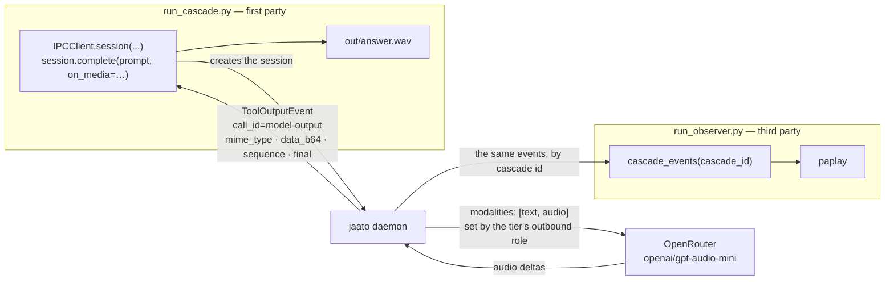

# jaato-cascade-audio-interchange

A two-process demonstration that a jaato session can **answer a text
question out loud**, and that a second, unrelated process can **listen to
it as it speaks**.

The model is asked "What colour is the sky on a clear day?" and replies
with audio. `run_cascade.py` saves that audio as a WAV; `run_observer.py`
— which never creates a session and never sends a message — plays the
same bytes through PulseAudio as they arrive.



The driver **created** that session; the observer only knows its cascade
id. Those are two different SDK surfaces — `session.complete(on_media=…)`
for your own result, `cascade_events(...)` for someone else's — and the
split between the two scripts follows that line, not a lifecycle-vs-data
one.

## What it actually demonstrates

**The tier declares the role; nothing in this client asks for audio.**
The `speaker` profile has one tier carrying `modalities: {audio:
outbound}`. Entering that tier is what puts `modalities: ["text",
"audio"]` and `audio: {voice, format}` on the request. Neither script
mentions audio to the daemon — remove the tier key and the same code
gets a text answer.

**Model speech is told apart from a tool's bytes by `call_id`.** Media
the model produced arrives under the reserved `call_id` `"model-output"`;
media a tool returned arrives under that tool's call id. Both travel on
the same `ToolOutputEvent` channel.

**The two scripts share an id, not a module.** The observer never imports
the driver. They agree on a cascade id and nothing else, so either can be
rewritten without touching the other.

**They divide along first-party vs third-party, not lifecycle vs data.**
The driver owns the cascade's lifecycle *and reads its own result* — it
opens each stage with `IPCClient.session(...)`, gets the typed completion
payload back from `session.complete(...)`, and receives the model's speech
through that call's `on_media` sink. The observer is a *third party*: it
created nothing, and attaches to a cascade id it was handed
(`cascade_events(role="observer")`). Those are two different SDK
mechanisms for two different jobs, which is why both touch media without
duplicating a responsibility.

**No event-loop plumbing.** The driver contains no `asyncio.Event`, no
`subscribe`, no `done.wait()`. `Session.complete` owns that recipe —
including settling when the *session* does rather than when its first turn
ends, which matters here because this stage is routinely nudged and a turn
boundary would report success while the model still had a tool call to
make.

## Running it

```bash
./run.sh                                  # driver only, writes out/answer.wav
./run.sh -o                               # driver + observer, plays it live
./run.sh -p "¿Por qué el mar es salado?"  # ask something else
./run.sh -o -q -p "Count to three."       # observe, trace without sound
./run.sh -s duet                          # the two-tier scenario, below
./run.sh --socket /tmp/other.sock         # a daemon listening elsewhere
./run.sh --help                           # every flag, from the script itself
```

`-s` picks the **scenario** (`speaker`, the default, or `duet`); `-p`
gives the question. An unknown scenario is refused immediately, listing
the ones that exist — the profile file is on disk, so there is no reason
to spend a 60-second daemon timeout discovering a typo.

`PYTHON` overrides the interpreter (default `python3`, so an activated
virtualenv is used as-is).

The daemon defaults to the SDK's own default socket, so this runs against
a stock `jaato-server` with nothing to configure. Point it elsewhere with
`--socket /path/to.sock` or `JAATO_IPC_SOCKET` — a second daemon for
development, a per-user socket, a container path. Nothing here hardcodes
a path, which also keeps it correct on Windows, where the default is a
named pipe rather than a file.

With `-o` the observer's trace streams into the terminal as chunks
arrive, and the wrapper waits for playback to finish before returning —
it says so while it waits, because a 30-second answer means 30 seconds
between the driver's last line and the shell prompt.

`-o` exists because **ordering matters**: a one-stage run takes about
seven seconds, less than a second Python process needs to boot, connect
and register, so an observer started after the driver attaches to a
cascade that has already ended and hears nothing at all. `run.sh -o`
starts the observer first and waits for it to report itself attached
before firing.

The two scripts can still be driven directly, sharing a cascade id:

```bash
CID=$(python -c "import uuid;print(uuid.uuid4().hex)")
python run_observer.py $CID &
python run_cascade.py  $CID --prompt "What makes a rainbow?"
```

**It usually answers in the language you ask in** — the persona sets the
form, not the language. "Usually" is measured, not hedging: 3 of 4 runs
of the same English prompt answered in English and one answered in
Spanish. No cause found; the daemon's `LANG` was the obvious suspect and
is a dead end, since the framework touches locale only for Windows
console encoding and never the prompt.

### Preflight

```bash
jaato-doctor --workspace . --env-file .env
```

### The daemon must speak protocol 1.4

Media on `ToolOutputEvent` (`mime_type`, `data_b64`, `sequence`,
`stream_id`, `final`) arrived in wire protocol **1.4**, so both scripts
declare it:

```python
IPCClient(SOCKET, ..., min_protocol_version="1.4")
```

Against an older daemon the connection is refused by name rather than
running and hearing nothing — those fields are simply never sent, which
is indistinguishable from a model that chose not to speak.

Separately, note that an editable install pointing at one checkout while
the daemon runs another via `PYTHONPATH` gives the two halves different
event shapes, and no version check catches that (the daemon is new
enough; the client just cannot parse it). See KNOWN_ISSUES.md #823.

## Layout

| Path | What it is |
|------|-----------|
| `run.sh` | Wrapper: runs the driver alone, or with the observer attached first |
| `run_cascade.py` | Fires one stage, reassembles the audio, writes `out/answer.wav` |
| `run_observer.py` | Attaches to a cascade id, traces events, hands speech to the player |
| `pulse_playback.py` | PulseAudio playback for headerless PCM — knows nothing about jaato |
| `speech_collector.py` | Reassembles chunks into a WAV — likewise knows nothing about jaato |
| `ptt_capture.py` | Cuts a push-to-talk microphone into utterances — knows nothing about jaato |
| `run_voice.py` | The INBOUND driver: an utterance goes up as an attachment, the answer comes back as speech |
| `.jaato/agents/helpdesk.md` | Esteban — a simulated insurance helpdesk that opens the call |
| `mock_helpdesk.py` | The policy/claim systems, simulated — stdlib, no dependencies |
| `.jaato/services/lineadirecta/` | Their service catalog, as the model sees it |
| `.jaato/profiles/openrouter_gpt_audio_mini/listener.yaml` | Audio IN, text OUT — the instrument for checking what was said |
| `.jaato/profiles/_base_speaker.yaml` | Tier-1 base: no plugins, completion gating, no provider bound |
| `.jaato/profiles/openrouter_gpt_audio_mini/speaker.yaml` | Tier-2 set: binds OpenRouter + `openai/gpt-audio-mini`, declares the speaking tier |
| `.jaato/agents/speaker.md` | The `speaker` persona — answer in one spoken sentence |
| `.jaato/profiles/openrouter_gpt_audio_mini/duet.yaml` | The second scenario: a text planner plus a speaking tier |
| `.jaato/agents/duet.md` | The `duet` persona — decide, delegate the speaking, complete |
| `.jaato/scripts/processors/spoken_was_spoken.py` | Completion validator: refuses a `spoken` payload the session never delegated |

The base profile stays provider-agnostic on purpose: to try another
audio model, add a sibling set directory and select it with
`JAATO_PROFILE_SET`.  Both agents live in one set because they differ by
SCENARIO, not by binding — a second provider set would then give you both
of them without restating either.

## The inbound half — you speak to it

Everything above is the framework speaking. `run_voice.py` is the other
direction, and both directions now happen in one turn.

`ptt_capture.py` is the microphone half and knows nothing about jaato:
it reads a PipeWire/PulseAudio source continuously and cuts it into
utterances using an **out-of-band** press signal (a `pw-metadata` key),
never by inferring boundaries from the audio. Silence during a press is
identical in the samples to silence between presses, so no level
detector can tell "still listening" from "done" — the same lesson the
outbound half learned when every attempt to infer where a stream ended
closed a player mid-utterance.

The numbers in it were measured against real hardware, not assumed:

| What | Measured |
|------|----------|
| `parec` default buffer | **2 seconds** — first read at t=1.977s, then 40 blocks at once. Every boundary lands on a 2s grid unless `--latency-msec` is set. |
| Pipeline latency `L` | bounded to **250–840 ms** by two real presses; the tail is 2500 ms to sit past it, not near it |
| Press-key semantics | a **level**, not an event stream — the connect dump is sometimes delivered twice |

`run_voice.py` is the join, and it is deliberately thin: it attaches WAV
bytes and reads speech back. It never mentions audio in either
direction — the `voice` profile's one tier does, with
`modalities: {audio: bidirectional}`. That single word does two
separable jobs: **outbound** puts `modalities: ["text","audio"]` on the
request, and **inbound** is what lets an `audio/*` attachment reach the
wire as an `input_audio` block instead of being withheld beside video.

Proven on content rather than on plausibility — asked to repeat what it
heard, the model returned the words that were actually spoken:

```
sent            88 044 bytes of real speech — "Esto es una nueva prueba."
model repeated  "Esto es una nueva."
spoke back      4 chunks, 1.55s of audio
```

That tier is named `voice`, not `executor`. Tier names stopped being a
closed set: a deployment names its own, subject to
`^[a-z][a-z0-9_]{1,31}$`, and a free name must carry a `description`
because that is what a canonical name gets for free. The four canonical
names still mean something to the framework, and `vision` alone implies
a modality role — so this tier states its own.

The call is `session.complete("", attachments=[utterance])`, with an
empty prompt on purpose: the question IS the attachment, and a text
prompt beside it would be a second question the persona has to choose
between.

The loop also closes on itself, which is the shortest way to see both
directions at once — the `speaker` profile speaks a question, and the
`voice` profile is handed that audio as its input:

```
1. framework SPOKE the question : 127 244 bytes of audio
2. framework HEARD it, answered : "...the sky being blue on a clear day."
   and spoke the answer         : 13 chunks, 5.10s
```

No transcription anywhere in that loop — the audio goes to the model as
audio, in both directions.

## The helpdesk scenario

`run_voice.py --greet --agent helpdesk` makes the agent answer the
phone. It is Esteban, of a simulated Línea Directa Aseguradora customer
line, and he speaks BEFORE the first press:

> «Buenos días, bienvenido a la línea de atención al cliente de Línea
> Directa Aseguradora. Me llamo Esteban, ¿en qué puedo ayudarle?»

Then you press, ask, and he answers — the order a real call has, which
is why the greeting is not just another turn in the loop.

The greeting's WORDS live in the persona, not the driver. All the driver
sends is a stage direction (`OPENING_CUE`, a bracketed line saying the
call is connected); who the agent is and how it answers the phone are
the persona's business. Verified that the direction is acted on rather
than read aloud — see below for how.

It is a SIMULATION and the persona says so: no policy data, no records,
and an explicit instruction not to invent a policy number, because an
invented one sounds exactly like a real one.

### The systems behind the call

An agent that cannot look anything up is not a helpdesk. Without a
backend every call ended the same way — «no puedo consultarlo desde
aquí» — which demonstrates a broken helpdesk rather than a working one.

`mock_helpdesk.py` supplies the two systems an operator actually
touches, and `.jaato/services/lineadirecta/` describes them so the model
can call them:

| Operation | What it does |
|-----------|--------------|
| `buscar-poliza` | `GET /v1/polizas?poliza=…` or `?dni=…` — either key locates the customer |
| `abrir-siniestro` | `POST /v1/siniestros` — registers the parte, returns the expediente number |

```
python mock_helpdesk.py &                                   # port 8731
python run_voice.py --profile helpdesk --agent helpdesk --greet
```

The mock prints the demo policies at startup; say one of those numbers
on the phone and the agent finds it. Say anything else and it correctly
reports not finding it — which is worth showing too, since an operator
who "finds" every policy is not demonstrating a lookup.

**Numbers arrive by voice, so the lookup compares loosely.** A policy
number read aloud and typed back by a model comes with the spaces and
pauses it heard: `LD 2026 004417` and `ld.2026.004417` both resolve.
That is not laxity — it is the difference between a demo that works when
spoken and one that only works when pasted.

**One tool, eagerly, and nothing else:**

```yaml
plugins:
  - "service_connector(mode:preload, tools:[call_service])"
```

`mode:preload` puts it in the initial schema so a spoken turn never
spends a round trip discovering tools; `tools:[…]` drops the plugin's
other eight from the wire body *and* the grammar surface — which matters
here for a reason it would not in a text agent, since every tool in the
schema is a name this model might read out loud.

**`call_service` is gated, and a voice call cannot answer a permission
prompt** — there is nowhere to show one and nobody to click it. Left
unanswered the turn simply stops: the session went quiet with no error
and the run spoke two turns of four. The profile therefore whitelists
that one tool rather than opening the default policy:

```yaml
permission:
  policy:
    defaultPolicy: deny
    whitelist:
      tools: [call_service]
```

### Where the domain knowledge lives, and where it should live

Esteban follows a real intake script — is anyone hurt, then policy
number and DNI and plate, then the facts, then the other driver, then
the 7-day deadline. That script is not in the persona. It sits in
`.jaato/knowledge/siniestro_intake.md` and is pulled into the prompt at
session prep by a prefetch directive:

```
{{!py:scripts/knowledge.py siniestro_intake.md}}
```

The framework runs it during `configure()`, before the first turn, so
the knowledge is PRESENT rather than something the agent must decide to
look up. Persona and domain then change for different reasons: who the
agent is versus what the domain says.

**The correct jaato pattern is a reference, not a prefetch.** Domain
knowledge belongs in the `references` plugin's catalog — IDs and tags,
pre-selected per profile — and that is what a production agent should
use. What follows is why this demo deviates, not an argument that the
deviation generalises:

```yaml
plugins: [references]
plugin_configs:
  references:
    preselected: [siniestro_intake]
    lookup_strategy: hybrid
```

That gives what a prefetch cannot: selection by tag rather than
filename, semantic matching, transitive references, and the agent
reaching further documents mid-call with `selectReferences` instead of
carrying the whole catalog in its prompt from the first token.

This demo does not use it for one reason, and it is a real one: the
speaking profile runs `plugins: []` on purpose, because every tool in
the schema is a chance for the model to emit a tool call instead of
speech — and `listReferences` is a **core** tool, in the schema from
turn one. Against a model already inclined to read tool names aloud
(see KNOWN_ISSUES), that is a poor trade in a demo about audio. It is a
fine trade in a text agent, where a tool call costs nothing anyone can
hear.

## Checking what was actually said — the `listener` profile

A spoken turn returns no text, so a speaking agent cannot tell you what
it heard or said. `listener` is the third direction and the only one
that writes: `modalities: {audio: inbound}` with no outbound role, so
the reply arrives as ordinary text tokens.

That makes it the instrument for checking the other two. It is how the
greeting above was verified — generate it, feed the WAV to `listener`,
read back the words — and it caught two real slips in one pass: the
model saying "Línea Directa Seguradora" without the A, and answering
"¿en qué puedo ayudarte?" when the persona had asked for *usted*.

```
python run_voice.py --greet --agent helpdesk   # take the call
```

## Two scenarios

Same question, same models, two shapes. Measured on
`openai/gpt-audio-mini` (+ `gpt-4o-mini` as the planner):

| | `speaker` | `duet` |
|---|---|---|
| tiers | one | two: a text planner, an audio executor |
| audio generations per answer | **2** (the nudge fires) | **1** |
| completion nudge | fires ~every run | never |
| `spoken` payload | describes the nudge, not the answer | matches what was said |
| payload checked against history | no | yes, `completion_processors` |
| demonstrates | outbound media, minimally | how the framework makes a hand-off reliable |

Use `speaker` to see the smallest possible outbound-audio client. Use
`duet` for anything you intend to build on.

### `speaker` — the minimal one, and the one that misbehaves

`./run.sh` (the default). One audio model answers out loud and closes the
session. It is the smallest thing that demonstrates outbound media, which
is why it is the default and why the sections above describe it.

It is also the weaker demo, and the weakness is worth understanding
before you read anything into a run:

**The completion nudge fires almost every time** — 4 of 4 in the last
measured batch. `openai/gpt-audio-mini` does not emit a native tool call
unprompted at the end of a spoken turn: it says its sentence and stops,
and the framework's nudge is what gets it to call `signal_completion`.
So a `speaker` stage normally costs **two** billed audio generations, not
one. This is a model trait, not a framework fault, and `speaker` has no
way around it — a single tier has nowhere to hand off to.

**Which makes its completion payload untrustworthy.** The driver prints
`payload["spoken"]`, the model's own transcript of what it said. On a
nudged turn the model routinely fills that field describing the NUDGE
instead of its answer:

```
[user ] 'In one short sentence, what colour is the sky?'
[model] 'Lo cielo normalmente es azul cuando está despejado.'   <- what was SAID
[user ] 'Your session is about to end without calling signal_completion…'
[model] CALL signal_completion({"spoken": "Cualquier cosa más en la que
                                pueda ayudarte, o puedo finalizar ahora
                                la sesión, gracias."})           <- what was REPORTED
```

The audio is right; the payload is not. Trust `out/answer.wav` over the
printed line for this scenario, or use `duet`.

### `duet` — two tiers, and the one that behaves

`./run.sh -s duet`. A cheap text model decides the answer and closes the
session; an audio tier is entered only to say it. It is the shape a real
deployment usually wants — you rarely want your reasoning model and your
voice to be the same model — and it is where the framework's answer to
the problems above actually shows.

`enter_tier` is a MODE SWITCH, so returning from the speaking tier needs a
deliberate act by the model in it — routinely the model LEAST able to
perform one. Measured over four runs, the audio tier never handed back:
it said its sentence and stopped, and the framework's completion nudge —
a safety net for an agent that forgot to finish — was the only thing that
ever unblocked the return. In one run the audio model closed the session
itself, from the wrong tier, against its persona.

The executor tier therefore declares `exit_on: completion`: the framework
enters it, lets it do one completion, returns to the planner, and reports
what the delegate produced. The speaking model does nothing to hand back.
After that change the nudge disappears from every run:

```
before:  enter_tier(executor) → NUDGE → enter_tier(planner) → signal_completion
after:   enter_tier(executor) → [delegation report] → signal_completion
```

Returning the tier BINDING alone was not enough, and that is the
interesting part: the delegate's completion settling is what ENDS the
turn, so switching back handed the wheel to a tier with no turn to steer.
Reporting the outcome is what returns control — through the ordinary
mid-turn path, not through the nudge.

**The payload is checked against what actually happened.** A profile can
declare a `spoken` field and the model can fill it with text it wrote
itself, never having entered the speaking tier — which is exactly what a
twenty-line story request produced once. The schema checks the payload's
SHAPE; `completion_processors` checks its TRUTH:

```yaml
completion_processors:
  - script: scripts/processors/spoken_was_spoken.py
    on_error: fail_completion
```

It reads `context.tool_calls` — the session's real tool-call ledger — and
refuses a non-empty `spoken` when `enter_tier("executor")` was never
called. Note what that proves: the delegation was *requested*, not that
audio arrived, since no media count reaches a processor.

> **`exit_on` needs a framework that has it.** An older one parses the
> profile and ignores the key, so `duet` still runs — with the nudge, as
> above. That is the symptom to expect if the delegation report never
> appears in the trace; check for `TIER_EXIT_ARMED` in
> `.jaato/logs/duet_trace.jsonl` before suspecting the profile.

## Known issues

Framework defects found while building this are tracked in
[KNOWN_ISSUES.md](KNOWN_ISSUES.md), each linked to its upstream issue.
